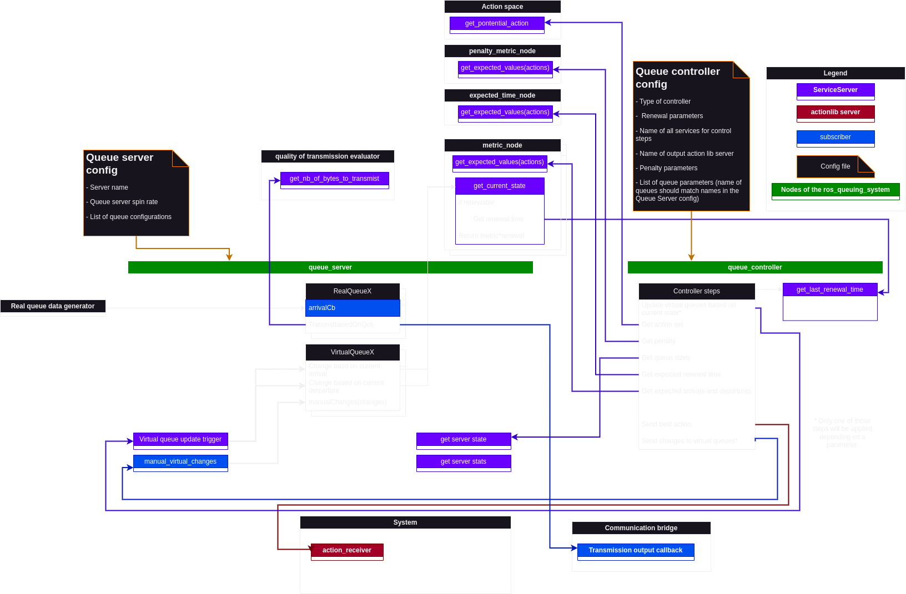
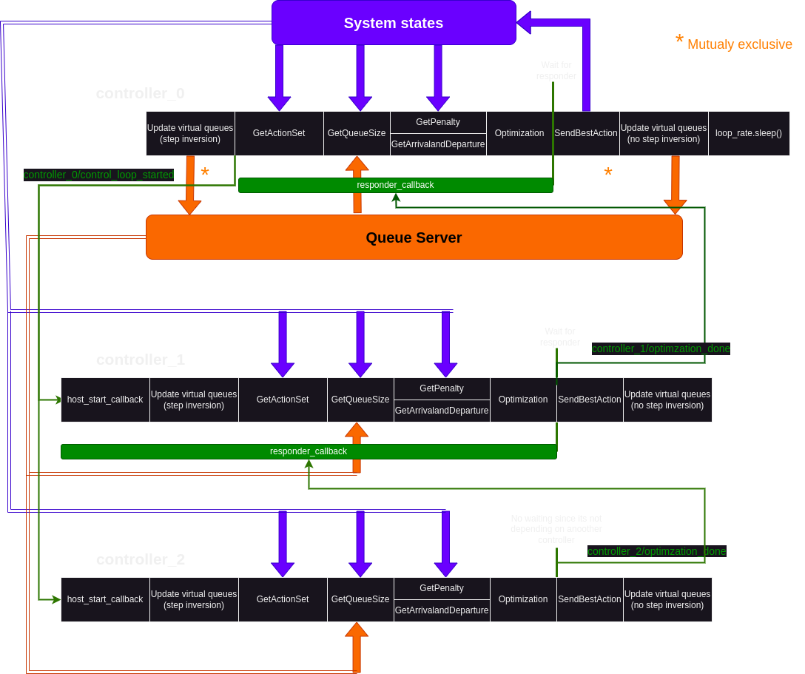

# queue_controller

## Overview

This package includes a queue stabilizing controller that tries to stabilize specified queues from a [queue_server](https://github.com/etienn8/ros_queuing_system/tree/main/queue_server) while minimizing the time average of a given metric. By using virtual queues [1], any scalar metrics could have its time average around a given target. At each time step, the controller gets a potential action set (generic ROS messages), evaluates for each action how the queues will change and, based on a cost function containing the optimizing variable, will decide which is the optimal action. The action is then sent to an [actionlib](http://wiki.ros.org/actionlib) server where the user should manage the execution of the selected action.

The optimization process used internally is the min drift-plus-penalty and its renewal version for variable time step system[1]. In addition to the original process of 1) Finding the optimal action and 2) Updating the queues based on this optimal action, the queue controller can reversed those steps: 1) Updating the queues based on the current state of the system and 2) Finding the next optimal action. This switch of paradigm hypothetically allows the queue server to be less biased by action uncertainties and by prediction errors from the model used in the controller.

**Keywords:** queuing theory, queue stabilizing controller, time average optimization

### License
The source code is released under a MIT license.

**Author: Étienne Villemure**
**Affiliation: [MoreLab](https://morelab.ca/) and [IntRoLab](https://introlab.3it.usherbrooke.ca/mediawiki-introlab/index.php/Main_Page)**
**Maintainer: Étienne Villemure, etienne.villemure@usherbrooke.ca**

The queue_controller package has been tested under [ROS] Noetic on Ubuntu 20.04.
This is research code, expect that it changes often and any fitness for a particular purpose is disclaimed.
## Installation
### Building from Source

#### Dependencies

- [Robot Operating System (ROS)](http://wiki.ros.org) (middleware for robotics),
- [queue_server](https://github.com/etienn8/ros_queuing_system/tree/main/queue_server) (server of queues that the controller will stabilize),
- [ros_queue_msgs](https://github.com/etienn8/ros_queuing_system/tree/feat/readme_ros_queue_and_server/ros_queue_msgs)(ROS data structures for the queues interfaces),
- [rosparam_utils](https://github.com/etienn8/rosparam_utils) (Tools to fetch rosparams more easily),
- [message_runtime](http://wiki.ros.org/message_runtime) (ROS message dependencies package),
- [actionlib_msgs](http://wiki.ros.org/actionlib_msgs) (Message definitions of the actionlib package used for the output of the controller),
- [actionlib](http://wiki.ros.org/actionlib) (Interfaces that gives a result and feedback for an action. Used by the output of the controller),
- [std_srvs](http://wiki.ros.org/std_srvs) (ROS standard service definitions), 
- [std_msgs](http://wiki.ros.org/std_msgs) (ROS standard service definitions),
- std::map (Standard library for C++ dictionnaries),
- std::utility (Standard library that permits move semantics),
- std::memory (Standard library for smart pointers),
- std::chrono (Used for the timing of the controller' steps),
- std::mutex (Library of mutexes to protect variable access from race condition),
- std::vector

	sudo rosdep install --from-paths src
#### Building

To build from source, clone the [rosparam_utils](https://github.com/etienn8/rosparam_utils) repo, clone the latest version from this repository into your catkin workspace and compile all the packages using

	cd catkin_workspace/src
	git clone https://github.com/etienn8/rosparam_utils.git
	git clone https://github.com/etienn8/ros_queuing_system.git
	cd ../
	rosdep install --from-paths . --ignore-src
	catkin_make

If you're using [catkin tools](https://catkin-tools.readthedocs.io/en/latest/installing.html), you could use `catkin build` command instead of `catkin_make`.

# Usage
### Quick launch
1. Configure the queues in the `config/min_drift-plus-penalty_template.yaml`  to create the desired controller. A basic example is provided but it can be modified or another config could be used. Instructions on how to configure the controller is provided in the next section.
3. Start the queue controller with: 
	`roslaunch queue_controller queue_controller_template.launch`

Alone a `queue_controller` doesn't do much, it will wait for all the services configured in its config file to be online before continuing. The queue controller is dependent on a lot of services to find find the best action to perform. All the required system interfaces will be defined in a section below. 

Assuming that all the required interfaces are available, the queue controller will found the best action to perform out of action set and will sent it through an actionlib client to a specified action lib server. To visualize the optimal action by the controller from a terminal, run: 
`rostopic echo <path_to_action_lib_server>/<action_lib_name>/goal`

In the case of a renewal controller where the time between each controller calls is variable, its possible to display the renewal time with:
	`rostopic echo /<queue_controller_name>/renewal_time`
Or get the last renewal time with:
	 `rosservice call /<queue_controller_name>/get_last_renewal_time`

## Optimization formulation
Let's start with an example to understand why the following optimization process is relevant and why queues are used to formulate the problem. Imagine a long run mission where a robot needs to explore an unknown communication-constrained environment as quick as possible and needs to return information to a base station as frequent as possible. Let's assume that the robot tries to optimize those two metrics at the same time. Thus, a formulation could be that it will penalize leaving the communication radius of the base station and it will penalize being far from new exploration frontiers. Finding the best action that optimize both metrics at each step might prevent the robot from leaving the base station's communication radius even though it has no new information to report. Therefore, optimizing this formulation at each time step might not lead to the quickest exploration overall compared to a method where the robot could leave the base station when it has no information to report. Instead of directly optimize this formulation at each time step, minimizing the time average of exploration and the frequent return on the overall mission might be more accurately what's desired. For example, the robot might leave the communication range for a few time frames thus optimizing more the exploration, then returns to the base station to report the information and then cycles between those two behaviors like that. Thus, the robot is optimizing on average both metrics but, in the point of view of a time step, it chose one metric over the other. Event if its seems trivial to hardcode this two-metric optimization example by hand, the problem might have more metrics to follow on average. Thus, a general framework could be helpful. If the problem is cast well, that's where queue-stabilizing controllers might become interesting. Those controllers find, at each time step, the optimal action to follow all its time average constraints while optimizing a time average metric.

The goal of queue_controller is to optimize the following formulation[1]:
```math
\begin{aligned}Minimize:\quad & \bar{y}_0\\ Subject\ to:\quad & \bar{y}_l \leq 0\ \forall l \ \in \{1, ..., L\} \\ & \bar{e}_l = 0\ \forall j \ \in \{1, ..., J\} \\& \textrm{Queues} \ Q_{k}(t)\ \textrm{are mean rate stable}\ \forall k \ \in \{1, ..., K\}\end{aligned}
```

where $`\bar{y}_0`$ represents a penalty (optimization variable to minimize), $`\bar{y}_1`$ represents the time average change of the virtual queue $`l`$, $`L`$ represents the number of inequality constrained virtual queues, $`\bar{e}_j`$ represents the time average change of the virtual queue $j$, $J$ represents the number of equality constrained virtual queues, $`Q_{k}(t)`$ a real queue $`K`$, $`K`$ represents the number of real queues and $`t`$ is the time. The main difference between $`Z_l(t)`$ and $`H_j(t)`$ virtual queues is that the size of the queue $`H_{j}(t)`$ could go below 0 (see [ros_queue](https://github.com/etienn8/ros_queuing_system/tree/main/ros_queue)  or [1] for more information).

Even though it's mainly used to know which queues should be transmitted on a radio, this optimization framework could be useful in decision making in robotics. For example, let's re-use the problem of exploration described above. The penalty $`y_0(t)`$ could be the distance towards the closest exploration frontier, a virtual queue $`y_1(t)`$ could represents the time that the robot is disconnected from the base station minus a time average target and the possible actions could be positions in space. Thus, at each time step the robot will find the optimal position that will sometimes prefer to explore and other times to come back to the base station as long as its minimizing the distance towards the exploration point and respects the time average target that it needs to follow on average. 

The greedy algorithm used at each time step to optimize the general problem above is the min drift-plus-penalty algorithm[1] ([Wikipedia](https://en.wikipedia.org/wiki/Drift_plus_penalty)). The cost function that the controller is minimizing is:

```math
\begin{aligned}Minimize:\quad & V\hat{y}_0(\alpha(t),\omega(t)) + \sum^{K}_{k=1}w_kQ_k(t)[\hat{a}_k(\alpha(t),\omega(t))-\hat{b}_k(\alpha(t),\omega(t))] + \sum^{L}_{l=1}w_lZ_{l}(t)\hat{y}_l(\alpha(t),\omega(t)) + \sum^{H}_{j=1}w_jH_{j}(t)\hat{e}_j(\alpha(t),\omega(t)) \\Subject\ to: \quad& \alpha(t) \in A_{\omega(t)}\end{aligned}
```

where $`\omega(t)`$ represents the state of the system (considered as a random variable), $`\alpha(t)`$ represents a potential action in the set of all action $`A_{\omega(t)}`$ at time $`t`$, $`V`$ represents a parameter that prioritize the penalty over the queue stabilization the higher it is, $`w_k\textrm{, }w_j \textrm{ and } w_j`$ represents weights that prioritize queues between each other, $`Q_k(t)`$ represents the size of the real queue $`k`$ at time $`t`$, $`Z_l(t) \textrm{ and } H_j(t)`$ represents the size of the virtual queues $`j`$ and $`l`$ respectively at time $`t`$, $`\hat{a}_k`$ represents the number of incoming data in the real queue $`k`$, $`\hat{b}_k`$ represents the number of data that could be transmitted, $`\hat{y}_l`$ represents the changes (arrival minus departure) of the virtual queue $`l`$ and $`\hat{e}_j$ represents the changes (arrival minus departure) of the queue virtual queue $j$. The function $\hat{y}_0\textrm{, }\hat{a}_k\textrm{, }\hat{b}_k\textrm{, }\hat{y}_l\textrm{ and }\hat{e}_j`$ are all function evaluated at the current state $`\omega(t)`$ and potential action $`\alpha(t)`$. In other words, the controller will evaluate this cost function for each action in the action set based on predictions on what the penalty will be and how the queues will changes knowing the current state of the system. For the interested reader, the "memory" that allows each greedy controller steps to be aware of the average is embedded in the queue size that changes over based on the control actions.

Once the best action is found, the queues will be updated based on the arrivals and departures expected from the optimal action [1].  A configuration also allowed the system to update the queues at the beginning of the next time step instead. It allows the queues to be updated with the real change in the system, thus removing bias from a bad action execution and bad prediction models. A renewal version of the min drift-plus-penalty algorithm is also implemented [1]. That version takes into account that the time between the controller calls might not be constant. Thus the controller scales some specified penalty, arrivals and departures with the expected time it takes to perform the action to ensure a certain rate. The change in the formulation is shown in the configuration section below.
## System explanation
The following figure shows a generic example in which the controller could be installed. It mainly shows all the important interfaces that needs to be provided so the queue controller can find an optimal action:


Like shown in the above figure, the queue_controller and the [queue_server](https://github.com/etienn8/ros_queuing_system/tree/main/queue_server) are two main important components provided in the [ros_queue_system](https://github.com/etienn8/ros_queuing_system) . While the queue_server can be used as standalone node that holds queues, the queue_controller tries to stabilize queues and is designed to connect to the interfaces of a queue_server. Outside of the queue_server, the user needs to provide all other interfaces listed in the configuration section (except for certain parameters that are required for specific controller types). 

The main steps of the queue controllers are the following:
- Get all potential actions that the robot can perform in the format of a ROS message (could be a navigation goal, a decision to transmit over a radio, ...). The configuration section shows how to indicate which ROS message to use as an action.
- Evaluates the expected penalty (optimization variable to minimize) for each action. It does so by calling a service containing all the potential actions in its request and the scalar penalty for each action in its response. 
- Measures the current size of the queues that the controller wants to stabilize from its provided queue_server.
- [Only used by the renewal controller version] Evaluates the expected time it will take before the next controller call will be made. It does so by calling a service containing all the potential actions in its request and the time it will take to perform that action.
- Evaluates the expected arrivals and departures of the queues (how the queues grow and diminishes) based each action. 
- Execute either the min drift-plus-penalty or its renewal version (based on configuration) and find the optimal action based on all the fetch metrics.
- Send the best action through an actionlib client to a specifier server. The actionlib interfaces are mainly used for the renewal system since it allows to know the time it took to perform the real action and thus bounding the renewal time if it goes out of bounds ($t_{renewal\_min}$ and $t_{renewal\_max}$).
- Update the virtual queues based on the expected arrival and departures of the optimal action decided by the controller. It does so through a topic to the queue_server. However, this step might be performed at the start of the controller and, instead of using the best action arrival and departures, the queue_controller will trigger a service of the queue_server where the virtual queues will update themselves based on the current state of the system.

A keypoint that needs be to highlighted is that the queue_controller is agnostic from the type of action. Even though it needs the definition of the action message to compile, it only moves around those actions to services to get its metrics. In other terms, the queue_controller is a framework and the responsibility of evaluating the metrics is on the user's side.
# Configuration 
## Change the action type
Even though most of the configurations could be set in a config file, the controller is dependent on knowing the type of the action (that is a ROS message) at compilation. Therefore, if it's desired to use a new type of action that is not already present in the [ros_queue_msgs](https://github.com/etienn8/ros_queuing_system/tree/main/ros_queue_msgs), new files and some configuration should be added.

#### Create the messages
Five messages and services definition needs to be defined at compilation for the controller. If the action type that is desired is not already available in the [ros_queue_msgs](https://github.com/etienn8/ros_queuing_system/tree/main/ros_queue_msgs/msg), you should create them:
1. The action definition message that is defines the actual action. Add it in the [ros_queue_msgs/msg](https://github.com/etienn8/ros_queuing_system/tree/main/ros_queue_msgs/msg) directory. An example is the `TransmissionVector.msg` in [ros_queue_msgs](https://github.com/etienn8/ros_queuing_system/tree/main/ros_queue_msgs/msg)
2. The message containing the sets of actions. It should have an array named `action_set` of the action message name defined above. Add it in the [ros_queue_msgs/msg](https://github.com/etienn8/ros_queuing_system/tree/main/ros_queue_msgs/msg) directory. Following the same example, the content of `PotentialTransmissionVectorSet.msg` from [ros_queue_msgs](https://github.com/etienn8/ros_queuing_system/tree/main/ros_queue_msgs/msg) is:
	`ros_queue_msgs/TransmissionVector[] action_set`
3. The service that gets the action set. The request should be empty and the return should be a value name `action_set` that  has the type of the action set message defined in 2. Add it in the [ros_queue_msgs/srv](https://github.com/etienn8/ros_queuing_system/tree/main/ros_queue_msgs/srv) directory. Following the same example, the content of `PotentialTransmissionVectorSpaceFetch.srv`  is
	```
	---
	ros_queue_msgs/PotentialTransmissionVectorSet action_set
	```
4. The service used to get predicted metrics like the expected penalties, renewal times and arrival and departures based on the action set. The request should be a action set message (defined at 2.) variable named `action_set` and the output should be an array of float32 called `predictions`. Add it in the [ros_queue_msgs/srv](https://github.com/etienn8/ros_queuing_system/tree/main/ros_queue_msgs/srv) directory. Following the same example, the content of `MetricTransmissionVectorPredictions.srv` is:
	```
	ros_queue_msgs/PotentialTransmissionVectorSet action_set
	---
	float32[] predictions
	```
5.  The actionlib message that is used as the output of the controller. The goal should be with the type of the action goal message (defined at 1.) and named `action_goal`. The result should only be a bool name `success`. The feedback message is not needed. Add it in the [ros_queue_msgs/action](https://github.com/etienn8/ros_queuing_system/tree/main/ros_queue_msgs/action) directory. Following the same example, the content of `TransmissionVector.action` defined in [ros_queue_msgs/action](https://github.com/etienn8/ros_queuing_system/tree/main/ros_queue_msgs/action)is :
	```
	# The goal
	ros_queue_msgs/TransmissionVector action_goal
	---
	# The result
	bool success
	---
	# The feedback
	```
6.  The message used to log the internal cost of each controller metrics for a given action. Two fields should be defined: A variable named `action` with the type of the action type and a variable name `costs` of the type [ros_queue_msgs/ControllerActionCosts](https://github.com/etienn8/ros_queuing_system/tree/main/ros_queue_msgs/msg/ControllerActionCosts.msg). Add it in the [ros_queue_msgs/msg](https://github.com/etienn8/ros_queuing_system/tree/main/ros_queue_msgs/msg) directory. Following the same example, the content of `TransmissionVectorControllerCosts.msg` defined in [ros_queue_msgs/msg](https://github.com/etienn8/ros_queuing_system/tree/main/ros_queue_msgs/msg)is :
	```
	ros_queue_msgs/TransmissionVector action
	ros_queue_msgs/ControllerActionCosts costs
	```
7.  The message of the list of all the internal costs for each action for a control steps. It should have a single field named `action_costs_list` that is an array of the message defined in step 6. Add it in the [ros_queue_msgs/msg](https://github.com/etienn8/ros_queuing_system/tree/main/ros_queue_msgs/msg) directory. Following the same example, the content of `TransmissionVectorControllerCosts.msg` defined in [ros_queue_msgs/msg](https://github.com/etienn8/ros_queuing_system/tree/main/ros_queue_msgs/msg)is :
	```
	ros_queue_msgs/TransmissionVectorControllerCosts[] action_costs_list
	```

Once all the new messages created, don't forget to include to the [CMakeList.txt](https://github.com/etienn8/ros_queuing_system/blob/main/ros_queue_msgs/CMakeLists.txt) of the ros_queue_msgs package to generate them.  Once done, build the catkin workspace.

#### Create the new source files
1. In the directory `queue_controller/include/queue_controller/action_configs/`, copy and paste the `transmission_vector_controller_config.hpp` file in the same directory.
2. Renamed it with a relevant name linked to the new added action.
3. Edit the content of the new file:
	1. Replace all the five first `#include` of the old messages with the first five new messages created above. The last include should be replaced by the message created at the step 7.
	2. Change the type of the `typedef` (not the name of the `typedef`) in the following manner (be careful to add the "Action" and "Goal" suffix at the end of the two last message definitions respectively):
	```
	typedef ros_queue_msgs::<Name of the metric prediction message defined at the step 4. of "Create the messages"> METRIC_CONTROL_PREDICTION_SRV;
	typedef ros_queue_msgs::<Name of the action message set defined at the step 2. of "Create the messages"> POTENTIAL_ACTION_SET_MSG;
	typedef ros_queue_msgs::<Name of the action set fetch service defined at the step 3. of "Create the messages"> POTENTIAL_ACTION_SET_SRV;
	typedef ros_queue_msgs::<Name of the action lib message defined at the step 5. of "Create the messages">Action ACTION_LIB_OUTPUT_TYPE;
	typedef ros_queue_msgs::<Name of the action lib message defined at the step 7. of "Create the messages">Goal CONTROLLER_COSTS_LIST_TYPE;
	```
4. In the directory `queue_controller/src/` copy and paste the `transmission_vector_queue_controller_node.cpp` file in the same directory.
5. Renamed it with a relevant name linked to the new added action.
6. Edit the content of the new source file and change the line `#include "queue_controller/action_configs/transmission_vector_controller_config.hpp"` to point towards the file `.hpp` that you created at step 2.

#### Update the CMakeList.txt
1. Add the following lines in the queue_controller's CMakeList.txt by replacing the terms in "<>":
```
add_executable(<name of new target> src/<name of the source file created at step 4 and 5 from the section "Create the new source files">.cpp)

add_dependencies(<name of new target> ${${PROJECT_NAME}_EXPORTED_TARGETS} ${catkin_EXPORTED_TARGETS})

target_link_libraries(<name of new target>
	${catkin_LIBRARIES}
)
```
2. Build the catkin workspace.
## Config files
Since most of the configuration is required (except when it's indicated that it isn't), the queue controller will not initialize if parameters are missing. A lot of logging is done through `ROS_WARN` and `ROS_ERROR` so it should be easy to found the missing parameters.

**min_drift-plus-penalty_template.yaml**: Its a template of all possible parameters of the queue_controller node. It's meant to be copied and adapted. It's generally included via a path in a launchfile.
- `controller_type`(string): The type of controller that should be used. The two supported types are: `min_drift_plus_penalty` and `renewal_min_drift_plus_penalty`.
- `is_periodic`(bool): If set to true, the controller will indefinitely start a new control loop  after the current loop based on the timing of the controller type. If set to false, the controller will only execute a control loop whenever it received a service call to it's service `start_control_loop` or a empty msg on its `start_control_loop` topic.
- `time_step` (float): Period between each controller optimization process. Only used for the min_drift_plus_penalty type of controller and if the parameter `is_periodic` is set to true.
- `inverse_control_and_steps` (bool, default: false): If set to false, the controller will 1)find an optimal  action to take and then 2) update the virtual queues based on that optimal solution. If set to true, the controller will 1)update the virtual queues based on the current of state of the system and then 2)find an optimal next action. 
- `measure_cost: false`(bool): When true, a topic will be published name "controller_costs" that will output the cost of each action and each internal metric of the actions at each controller step. Default is set to false.
- `min_renewal_time`(float): Lower bound time for the renewal process. The controller will not start again before that time even if the action is reached. The action reached is triggered by a message to a goal_reached topic. Only used if the controller is of type `renewal_min_drift_plus_penalty`.
- `max_renewal_time`(float): Upper bound time for the renewal process. The controller will start again at that time if the action is not reached. The action reached is triggered by a message to a goal_reached topic. Only used if the controller is of type `renewal_min_drift_plus_penalty`.
- `action_server_name`(string): Name of the actionlib server to which the best action will be sent as a goal. That server as the responsibility to send back a goal reached for the renewal system if it reaches the action.
- `solution_space_service_name`(string): Name of the service server that returns all the current potential action that could be performed at the next controller step.
- `expected_renewal_time_service_name`(string): Name of the service that evaluates the expected renewal times it takes for each potential action.  Only used if the controller is of type `renewal_min_drift_plus_penalty`.
- `queue_server_name`(string): Name of the [queue_server](https://github.com/etienn8/ros_queuing_system/tree/main/queue_server) node that the queue_controller expects to get its queues from.
- `queue_list`(list): List of all the queue's configurations that will be stabilized by the queue_controller. The list can take an arbitrary number of queue's configuration as long as it's following the structure below:
	- `<Name of the queue>` (struct): The name of the struct should correspond to the name of a queue in the [queue_server](https://github.com/etienn8/ros_queuing_system/tree/main/queue_server) specified by the `queue_server_name`. 
		- `Weight` (float): Priority weight that multiplies the cost of a queue. It corresponds to the parameter $w$ from the section "Optimization formulation". A higher value compared to other queues means that the queue will try to stabilize faster compared to them.
		- `expected_arrival_service_name` (string): Name of the service that returns the predicted value of the arrivals for the current time step.
		- `arrival_action_dependent` (bool, default: false): Indicates if the arrival prediction is dependent on the action type. For example, it the prediction is a static value like a target. If set to false, the service definition of the service of `expected_arrival_service_name` should be [ros_queue_msgs/FloatRequest](https://github.com/etienn8/ros_queuing_system/blob/main/ros_queue_msgs/srv/FloatRequest.srv), thus allowing to return only one value that will be the same for all action. If set to true, the arrival service definition should match the service definition of the `METRIC_CONTROL_PREDICTION_SRV` type in the controller node's cpp file.
		- `arrival_renewal_dependent`(bool, default: false): Indicates if the arrivals should scale with the expected renewal and therefore should be multiplied by it. Only used if the controller is of type `renewal_min_drift_plus_penalty`.
		- `expected_departure_service_name` (string): Name of the service that returns the predicted value of the departures for the current time step.
		- `departure_action_dependent` (bool, default: false): Indicates if the arrival prediction is dependent on the action type. For example, it the prediction is a static value like a target. If set to false, the service definition of the service of `expected_departure_service_name` should be [ros_queue_msgs/FloatRequest](https://github.com/etienn8/ros_queuing_system/blob/main/ros_queue_msgs/srv/FloatRequest.srv), thus allowing to return only one value that will be the same for all action. If set to true, the departure service definition should match the service definition of the `METRIC_CONTROL_PREDICTION_SRV` type in the controller node's cpp file.
		- `departure_renewal_dependent`(bool, default: false): Indicates if the departures should scale with the expected renewal and therefore should be multiplied by it. Only used if the controller is of type `renewal_min_drift_plus_penalty`.
- `penalty_service_name`(string): Name of the service for the controller to get all the penalties for all the given action in the action set in its request. The service definition should match the service definition of the `METRIC_CONTROL_PREDICTION_SRV` type in the controller node's cpp file
- `v_parameter`(float): It's the weight that multiplies the penalty in the cost function. It specifies the trade-off between optimizing the variable and the delays (linked to the expected size of the queues). A higher value will bring the penalty closer to its optimal value at the expanse of increasing the expected queue sizes. It represents mathematically the parameter $V$ from the section "Optimization formulation".
- `is_penalty_renewal_dependent`(bool): If set to true, the controller will optimize the ratio of the time average penalty over the expected renewal frame duration. If set to false, the controller will optimize the time average penalty.  It's used when the value to minimize is $\frac{\bar{v}_o}{\bar{T}}$ instead of $\bar{y}_0$. Only used if the controller is of type `renewal_min_drift_plus_penalty`.
- `part_of_multicontroller_synchronization`(bool): Flag that indicates if this controller is part of a multi controller setup. It will send empty msgs on a topic `control_loop_started` at the begining of the control loop and a topic `optimization_done` after the optimization but before sending the best action and the manual changes to the queue server.
- `start_control_loop_sync_topic` (string): If defined, if the parameter `is_periodic` is set to false and `part_of_multicontroller_synchronization` is true, it will add a new subscribe with the specified name that will start a new control loop when it receive an empty msg. This is in addition to the `start_control_loop` topic. The main application for this is to put the `<master_controller_name>/control_loop_started` of a master queue controller so both controller starts at the same time in a multi-controller system that needs to be synchronized.
- `dependent_on_controller_topic` (string): Name of the topic that the controller will need to wait for before sending its command and changes .If defined and if `part_of_multicontroller_synchronization` is true, this controller will pause after its optimization and before to publish on `optimization_done`. A subscriber will be created that listens to the given topic name. When this subscriber is sent an empty msg, it will wake wake-up the controller allowing it to continue. If the message is received before the wait, the controller will simply continue. If this parameter is not defined or left empty, the controller will not wait to receive a message before continuing. This parameter is mainly used in a multi-controller setup where you specified the `<controller_to_depend_on_name>/optimization` of a controller that needs to have completed its optimization before the present controller can continue. A cascade setup could be used like in the following figure where a main controller needs to wait for all other controller before sendind its control value.


## Launch files
* **queue_controller.launch:** Starts a queue_controller node based on a given configuration and action type.
     - **`queue_controller_name`**: Name of the queue controller that will be use as the node's name and the prefixes of all it's exposed services. Default: `queue_controller`.
     - **`queue_controller_type`**: Name of the Catkin target of the action-specific controller node. It can take any target in the CMakeList.txt that is a queue_controller node. If a new target was created from the section "Change the action type", it could be used as this argument. Default: `transmission_vector_queue_controller_node`
     - **`queue_controller_config_path`** Path to the server queue_controller file. It needs to contain all the needed information like shown in the default config file. Default: "$(find queue_controller)/config/min_drift-plus-penalty_template.yaml"
## Nodes

### transmission_vector_queue_controller_node

Queue controller that takes as it's input a set of actions, evaluates by asking user defined services how the queues would changes for each action and find out the best action with a queue stabilizing algorithm. This node speficicaly was build with the action type [TransmissionVector.msg](https://github.com/etienn8/ros_queuing_system/blob/main/ros_queue_msgs/msg/TransmissionVector.msg). This type of action is an array of potential commbinations of queues that could transmit. All ROS interface names below will be the same for a new target that was build with a different action type except for the types of the messages that are dependent on the action set.

#### Service calls

* **`<expected_renewal_time_service_name>`** ([ros_queue_msgs/MetricTransmissionVectorPredictions](https://github.com/etienn8/ros_queuing_system/blob/main/ros_queue_msgs/srv/MetricTransmissionVectorPredictions.srv))
	 Service that evaluates all the renewal time (the time it takes to perform the action) for each action given in its request. The results should be returned in an array with a size equal to the number of actions and where the indexes of the times match the indexes of their corresponding actions from the input's array.
	
* **`<solution_space_service_name>`** ([ros_queue_msgs/PotentialTransmissionVectorSpaceFetch](https://github.com/etienn8/ros_queuing_system/blob/main/ros_queue_msgs/srv/PotentialTransmissionVectorSpaceFetch.srv))
	 Service that gets all the potential action for the next controller optimization. The request is empty.
	 
* **`<penalty_service_name>`** ([ros_queue_msgs/MetricTransmissionVectorPredictions](https://github.com/etienn8/ros_queuing_system/blob/main/ros_queue_msgs/srv/MetricTransmissionVectorPredictions.srv))
	 Service that evaluates the penalty for each action given in its request. The results should be returned in an array with a size equal to the number of actions and where the indexes of the times match the indexes of their corresponding actions from the input's array.
	 
* **`/<queue_server_name>/get_server_state`** ([ros_queue_msgs/QueueServerStateFetch](https://github.com/etienn8/ros_queuing_system/blob/main/ros_queue_msgs/srv/QueueServerStateFetch.srv))
	 Service that gets the size of the queues from the defined [queue_server](https://github.com/etienn8/ros_queuing_system/tree/main/queue_server). 
	
* **`/<queue_server_name>/trigger_service`** (std_srvs/Empty)
	 Service that requests the queue server to update it's virtual queues based on the current metrics. The [queue_server](https://github.com/etienn8/ros_queuing_system/tree/main/queue_server) has the responsibility to know those services. It's only used when the parameter `inverse_control_and_steps` is set to true.

For each queues:
* **`<expected_arrival_service_name>`** ([ros_queue_msgs/MetricTransmissionVectorPredictions](https://github.com/etienn8/ros_queuing_system/blob/main/ros_queue_msgs/srv/MetricTransmissionVectorPredictions.srv) or [ros_queue_msgs/FloatRequest](https://github.com/etienn8/ros_queuing_system/blob/main/ros_queue_msgs/srv/FloatRequest.srv))
	 Service that evaluates how a queue will grow for each given action in its request. The results should be returned in an array with a size equal to the number of actions and where the indexes of the arrivals match the indexes of their corresponding actions from the input's array. If the `arrival_action_dependent` parameter is set to true in the config file for this queue, the request is empty and only one value is returned that will be used for all the actions during the optimization process. Usually the latter has no impact on the optimization process if it's not renewal dependent.
* **`<expected_departure_service_name>`** ([ros_queue_msgs/MetricTransmissionVectorPredictions](https://github.com/etienn8/ros_queuing_system/blob/main/ros_queue_msgs/srv/MetricTransmissionVectorPredictions.srv) or [ros_queue_msgs/FloatRequest](https://github.com/etienn8/ros_queuing_system/blob/main/ros_queue_msgs/srv/FloatRequest.srv))
	 Service that evaluates how a queue will diminish for each given action in its request. The results should be returned in an array with a size equal to the number of actions and where the indexes of the departures match the indexes of their corresponding actions from the input's array. If the `departure_action_dependent` parameter is set to true in the config file for this queue, the request is empty and only one value is returned that will be used for all the actions during the optimization process. Usually the latter has no impact on the optimization process if it's not renewal dependent.
* **`/<queue_server_name>/<queue_name>/getQueueInfo`** ([ros_queue_msgs/QueueInfoFetch](https://github.com/etienn8/ros_queuing_system/blob/main/ros_queue_msgs/srv/QueueInfoFetch.srv))
	 Service that gets the meta information of the queue from the [queue_server](https://github.com/etienn8/ros_queuing_system/tree/main/queue_server) . Mainly it gets if the queue is virtual.
#### Services
* **`get_last_renewal_time`** ([ros_queue_msgs/FloatRequest](https://github.com/etienn8/ros_queuing_system/blob/main/ros_queue_msgs/srv/FloatRequest.srv))
	Service that can be called to get the elapsed time between the start of the current controller call and the start of the previous one (last renewal time). For example, you can get the last renewal time from the console with:

		rosservice call /<queue_controller_name>/get_last_renewal_time
* **`start_control_loop`** (std_srvs/Empty)
	Service that will start a control loop of the controller when called. It's only available if the parameter `is_periodic` is set to false. Note that for a renewable system, the controller will not wait for the renewal time of the action. For example, you can get start a control loop from the console with:

		rosservice call /<queue_controller_name>/start_control_loop

#### Published Topics
* **`control_loop_started`** (std_msgs/Empty)
	 Empty message that is published at the begining of the control loop or after the virtual queue change if the parameter `inverse_control_and_steps` is true. It's only published if the paramter `part_of_multicontroller_synchronization` is true. Mainly used for synchronizing muliple controllers together.
* **`optimization_done`** (std_msgs/Empty)
	 Empty message that is published after the optimization found the best command and before the sending command and virtual changes to the queue server. It's only published if the paramter `part_of_multicontroller_synchronization` is true. Mainly used for synchronizing muliple controllers together.
* **`measure_cost`** [ros_queue_msgs/TransmissionVectorControllerCostsList](https://github.com/etienn8/ros_queuing_system/blob/main/ros_queue_msgs/msg/TransmissionVectorControllerCostsList.msg)
	 Message that contains all the costs for each action and its metrics (penalty and queue). This message is sent at each end of the controller's loop. This topic isn't advertised if the `measure_cost` parameter is set to false.
* **`renewal_time`** (std_msgs/Float32)
	 Message that indicates the elapsed time between the start of the current controller call and the start of the previous controller call.
* **`/<queue_server_name>/virtual_queue_manual_changes`** ([ros_queue_msgs/VirtualQueueChangesList](https://github.com/etienn8/ros_queuing_system/blob/main/ros_queue_msgs/msg/VirtualQueueChangesList.msg))
	 Message containing an array of changes that need to be applied to the specified virtual queues. Those changes are based on the arrival and departure expected from the optimal action that was found. Only used if `inverse_control_and_steps` is set to false.
#### Subscribed Topics
* **`start_control_loop`** (std_msgs/Empty)
	When called, it will start a control loop asynchronously. It's only available if the parameter `is_periodic` is set to false.
* **`<start_control_loop_sync_topic>`** (std_msgs/Empty)
	When called, it will start a control loop asynchronously. It's only available if the parameter `is_periodic` is set to false and the parameter `part_of_multicontroller_synchronization` is set to true.
* **`<dependent_on_controller_topic>`** (std_msgs/Empty)
	Topic defined to indicate that the present controller should block its output until it receives an empty message on this topic. It's only used if `part_of_multicontroller_synchronization` is set to true. See the `Config files` section for more details.

#### Parameters
All the queue_server parameters are shown in the Config Files sections.

## Bugs & Feature Requests

Please report bugs and request features using the [Issue Tracker](https://github.com/etienn8/ros_queuing_system/issues).

# References

[1] M. J. Neely, *Stochastic Network Optimization with Application to Communication and Queueing Systems*, 1st ed. Cham: Springer Cham, 2022.